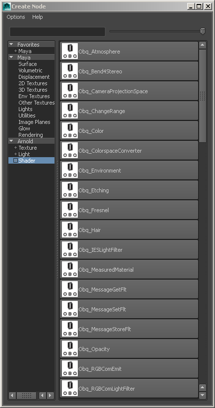

# Oblique Shaders for MtoA Dev Notes #

## How to Install ##

        + copy the content of the "metadata" folder into "C:\solidangle\mtoadeploy\<Maya Version>\shaders",[Windows]
        + copy the content of the "metadata" folder into "/opt/solidangle/mtoa/<Maya Version>/shaders/",[Linux]
        + copy the content of the "metadata" folder into "~/solidangle/mtoa/<Maya Version>/shaders/",[OSX]

        + copy the content of the "ae" folder into "C:\solidangle\mtoadeploy\<Maya Version>\scripts\mtoa\ui\ae",[Windows]
        + copy the content of the "ae" folder into "/opt/solidangle/mtoa/<Maya Version>/scripts/mtoa/ui/ae",[Linux]
        + copy the content of the "ae" folder into "~/solidangle/mtoa/<Maya Version>/scripts/mtoa/ui/ae",[OSX]

        + copy the content of the "icons" folder into "C:\solidangle\mtoadeploy\<Maya Version>\icons",[Windows]
        + copy the content of the "icons" folder into "/opt/solidangle/mtoa/<Maya Version/icons",[Linux]
        + copy the content of the "icons" folder into "~/solidangle/mtoa/<Maya Version/icons",[OSX]

        + copy the .dll     in "bin" into "/opt/solidangle/mtoa/<Maya Version>/shaders",[Windows]
        + copy the .so     in "bin" into "/opt/solidangle/mtoa/<Maya Version>/shaders",[Linux]
        + copy the .dylib in "bin" into " ~/solidangle/mtoa/<Maya Version>/shaders",[OSX]

Windows requirements:  
[Microsoft Visual C++ 2010 redistributable package (x64)](http://www.microsoft.com/en-us/download/details.aspx?id=14632)

### How to use Obq_Simbiont ###

Copy the `bin\dte\dte_2600_64.dll` (DarkTree library) to either `C:\Windows` or another [Windows] arbitrary directory (AD). If you chose the AD method, you'll need to append this AD to the PATH environment variable. 

For example, you can add: `set PATH=%PATH%;\\serverX\dte_folder` in the .bat that launches Maya (without the quotes). You will also need copy the `\bin\dte\dte_components` folder somewhere and change the path on line 30 of the `Obq_SimbiontTemplate.py` (the `componentLibsPath` parameters).

If you don't own a copy of DarkTree, you can download some DarkTree files here:  
[http://www.darksim.com/html/downloads.html](http://www.darksim.com/html/downloads.html)
  

## OBQ Shaders in Maya ##

The easiest way to check if MtoA has loaded the Oblique shaders is by opening up Maya's `Create Node` window and clicking on the Arnold render node section on the left side of the window. If the OBQ shaders are visible in the list and they have a custom "OBQ" icon then the shaders were installed correctly.

If MtoA has a problem loading the OBQ shaders you can check the Maya Script Editor window, and the Output window for more details.

## Version History ##

### 2014-11-30 Changes  ###
- **[ACH]** Updated the metadata file to add the new v303 shaders  
- **[ACH]** Updated Obq Help links in ae template files  
- **[ACH]** Added new Maya Node IDs to Metadata files:
	- Obq_MessageSetFlt
	- Obq_MessageStoreFlt
	- Obq_SetAlpha
	- Obq_SpectrumColor
	- Obq_TransformShadingPoint
- **[ACH]** Created a new `Obq_ColorspaceConverter` ae template file  
- **[ACH]** Renamed ae template file `Obq_MessageFltTemplate.py` to `Obq_MessageGetFltTemplate.py`

### 2014-10-19 Changes  ###
- **[ACH]** Added ae templates for the following shaders:

	- Obq_CameraProjectionSpace
	- Obq_Color
	- Obq_Etching
	- Obq_Fresnel
	- Obq_MessageFlt
	- Obq_Opacity
	- Obq_RandomID
	- Obq_RayDepth

### 2014-09-11 Changes  ###
- **[ACH]** Added the default shader settings to the Maya .mtd metadata file.
- **[ACH]** Added Obq_Simbiont ae template file.
- **[ACH]** Added OBQ_IESLightFilter ae template file.

### 2014-09-10 Changes  ###
- **[ACH]** Added Maya files for:
	- Obq_Atmosphere
	- Obq_Bend4Stereo
	- Obq_ChangeRange
	- Obq_Environment
	- Obq_RandomColor
- **[ACH]** Updated the Obq_ToonSimple ae template

### 2014-09-08 Changes  ###
- **[ACH]** Added custom Maya OBQ icons.
- **[ACH]** Renamed metadata file to match current shader DLL.

## Known Issues ##

### Obq_MeasuredMaterial ###
- Adding an Obq_MeasuredMaterial node to a Maya scene causes a crash. This might be caused by MtoA trying to render a preview swatch.

### Obq_ColorspaceConverterTemplate.py ###
- The ColorspaceIn and ColorspaceOut GUI elements haven't been implemented yet.

### Obq_MessageGetFltTemplate.pu  ###
- There is a name collision Issue where Maya's internal ".message" attribute is automatically linked into the shader's Arnold message attribute string field.

### OBQ Lens Shaders ###

MtoA loads lens shaders in Maya using the ae template file's `templates.registerTranslatorUI` function. At this point in time there appears to be an issue where the `Obq_AngularCamera` and `Obq_StereoLens` shaders aren't listed in the CameraShape node's Arnold section. This is something that has to be explored further.

Also the current MtoA release's registerTranslatorUI function won't allow a 3rd party lens shader to be associated as both a "camera" and a "stereoRigCamera" object. This means that lens shader's won't be able to be added to the center camera view in a stereo camera rig.

### Missing AE Template Files ###

Several of the Obq shader's lack ae template files. The following ae template files need to be created:

- Obq_MessageSetFlt
- Obq_MessageStoreFlt
- Obq_RGBComEmit
- Obq_RGBComLightFilter
- Obq_Root2Tip
- Obq_SetAlpha
- Obq_TransformUV
- Obq_SpectrumColor
- Obq_TransformShadingPoint
- Obq_VolumeThickness
- Obq_Hair
- Obq_SurfaceEnvironment
- Obq_Thickness
- Obq_Toon
- Obq_UVRemapLensDistortion
